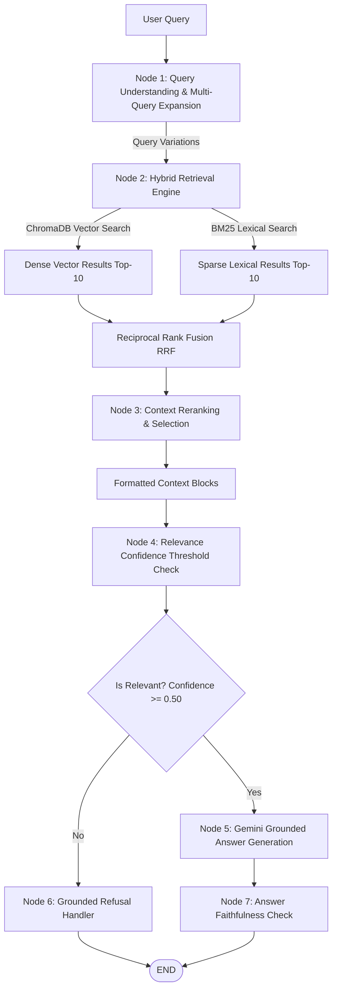

# Advanced Enterprise RAG Chatbot

[](https://www.python.org/downloads/)
[](https://fastapi.tiangolo.com/)
[](https://www.trychroma.com/)
[](https://langchain-ai.github.io/langgraph/)
[](https://github.com/dorianbrown/rank_bm25)

An advanced, enterprise-grade **Retrieval-Augmented Generation (RAG)** AI Chatbot built in Python following state-of-the-art AI Agent workflows.

The chatbot answers questions **strictly based** on the official [Agentic AI eBook Knowledge Base](https://konverge.ai/pdf/Ebook-Agentic-AI.pdf). It uses multi-query expansion, hybrid dense/sparse retrieval, Reciprocal Rank Fusion (RRF), cross-score reranking, and LangGraph faithfulness validation to guarantee zero hallucination.

---

## 1. Advanced Architecture Workflow



---

## 2. Key Enterprise Features

- **Multi-Query Expansion**: Rephrases and expands input queries into multiple domain-specific variations to maximize retrieval recall.
- **Hybrid Dense + Sparse Retrieval**: Combines semantic embeddings (`all-MiniLM-L6-v2` via ChromaDB) with sparse lexical keyword matching (`BM25Okapi` via `rank_bm25`).
- **Reciprocal Rank Fusion (RRF)**: Merges dense vector and sparse keyword rankings using $RRF(d) = \sum \frac{1}{60 + rank(d)}$.
- **Context Reranking**: Re-scores candidate context chunks using multi-token overlap and positional relevance.
- **Strict Grounding & Refusal**: Refuses to answer queries outside the knowledge base using clear refusal messaging without hallucinating.
- **LangGraph Faithfulness Validation**: Validates generated responses to ensure full factual fidelity to retrieved context.

---

## 3. Project Structure

```text
rag-agentic-ai/
│
├── data/
│   └── Agentic-AI.pdf        # Target eBook PDF document
│
├── app/
│   ├── __init__.py           # Package marker
│   ├── config.py             # Environment settings & thresholds
│   ├── ingestion.py          # PyMuPDF PDF extraction & chunking
│   ├── embeddings.py         # Dense vector embedding service
│   ├── vectorstore.py        # ChromaDB persistent store management
│   ├── retrieval.py          # Multi-Query, BM25, RRF Fusion & Reranking
│   ├── graph.py              # LangGraph workflow state machine
│   ├── llm.py                # Gemini LLM with strict grounding prompt
│   ├── ui.html               # Interactive Web UI interface
│   └── main.py               # FastAPI REST API & endpoints
│
├── scripts/
│   └── ingest.py             # Ingestion script
│
├── tests/
│   └── test_rag.py           # Automated test suite (13 test cases)
│
├── chroma_db/                # Persistent ChromaDB storage
├── .env.example              # Environment variable template
├── .env                      # Local environment variables
├── requirements.txt          # Python dependencies
└── README.md                 # Project documentation
```

---

## 4. Setup & Installation

### Prerequisites
- Python 3.10+
- Git

### Step-by-Step Setup

1. **Clone the Repository**:
   ```bash
   git clone https://github.com/Agastin03/RAG.git
   cd RAG
   ```

2. **Create and Activate Virtual Environment**:
   ```bash
   # Windows
   python -m venv .venv
   .venv\Scripts\activate

   # Linux / macOS
   python3 -m venv .venv
   source .venv/bin/activate
   ```

3. **Install Dependencies**:
   ```bash
   pip install -r requirements.txt
   ```

4. **Configure Environment Variables**:
   Copy `.env.example` to `.env`:
   ```bash
   # Windows
   copy .env.example .env

   # Linux / macOS
   cp .env.example .env
   ```

   Set your Gemini API key in `.env`:
   ```env
   GEMINI_API_KEY=your_gemini_api_key_here
   GEMINI_MODEL=gemini-3.1-flash-lite
   CHROMA_PERSIST_DIRECTORY=./chroma_db
   CHROMA_COLLECTION_NAME=agentic_ai_knowledge
   EMBEDDING_MODEL=all-MiniLM-L6-v2
   TOP_K=5
   RELEVANCE_THRESHOLD=0.50
   ```

---

## 5. PDF Ingestion

Run the ingestion script to process `Agentic-AI.pdf` into ChromaDB:

```bash
python scripts/ingest.py
```

---

## 6. Running the API & Web UI

Start the FastAPI server:

```bash
uvicorn app.main:app --reload --host 127.0.0.1 --port 8000
```

- **Interactive Web UI**: `http://127.0.0.1:8000`
- **Swagger Documentation**: `http://127.0.0.1:8000/docs`

---

## 7. API Endpoint Documentation

### 1. Health Check
- **Endpoint**: `GET /health`
- **Response**:
  ```json
  {
    "status": "healthy",
    "service": "Agentic AI RAG Chatbot API",
    "version": "1.0.0",
    "total_indexed_chunks": 123
  }
  ```

### 2. PDF Upload
- **Endpoint**: `POST /upload`
- Upload any PDF file dynamically to re-index ChromaDB.

### 3. Chat Query
- **Endpoint**: `POST /chat`
- **Request**: `{"question": "What is Agentic AI?"}`
- **Response**: Includes grounded answer, retrieved context chunks with page numbers, and confidence score.

---

## 8. Automated Testing

Run the pytest suite:
```bash
pytest tests/test_rag.py -v
```

All 13 test cases covering Web UI, PDF upload, health check, multi-query expansion, RRF fusion, context reranking, graph routing, and sample questions pass successfully.
